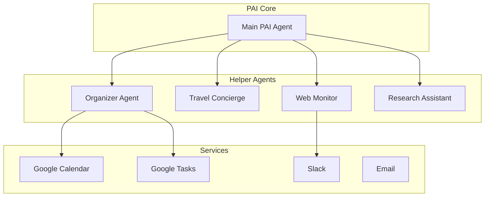

# PAI Helper Agents

## Overview

PAI (Personal AI Assistant) utilizes specialized AI agents to handle complex, domain-specific tasks. These agents operate as intelligent sub-systems that can be invoked to perform specialized operations with full tool access and autonomous decision-making capabilities.

## Architecture



## Available Agents

### 1. Organizer Agent (formerly task-calendar-toolkit-manager)

**Purpose**: Multi-account task and calendar management across personal and work Google accounts.

**Capabilities**:
- Manages tasks across multiple Google accounts (personal, xwander, accolade)
- Creates, updates, and tracks calendar events
- Detects scheduling conflicts between accounts
- Builds and maintains task/calendar tooling
- Implements intelligent routing based on context

**Invocation**:
```
Use the Organizer agent to:
- "Show me all my tasks for today across all accounts"
- "Find conflicts between my personal and work calendars"
- "Create a task in the appropriate account based on context"
```

**Key Features**:
- **Multi-Account Support**: Seamlessly manages personal@gmail.com, @xwander.fi, @accolade.fi
- **Context-Aware Routing**: Automatically selects appropriate account based on keywords
- **Offline-First Design**: Local SQLite database ensures tasks persist even without internet
- **Service Account Integration**: Direct calendar access without OAuth complexity

### 2. Travel Concierge Agent

**Purpose**: Comprehensive travel planning and flight research.

**Capabilities**:
- Searches for flight options across multiple airlines
- Builds complete travel itineraries
- Compares prices and routes
- Handles complex multi-city trips
- Creates travel comparison tools

**Invocation**:
```
Use the Travel Concierge agent to:
- "Find flights to Japan next month"
- "Plan a 2-week trip through Southeast Asia"
- "Compare flight prices across airlines for Helsinki to New York"
```

### 3. Web Monitor Agent (web-monitor-scheduler)

**Purpose**: Monitors websites for changes and sends alerts via Slack.

**Capabilities**:
- Tracks specific websites for updates
- Monitors product releases (e.g., Apple MacBook Pro)
- Watches for event announcements (e.g., band tour dates)
- Schedules regular checks based on importance
- Sends alerts to appropriate Slack channels

**Configuration Example**:
```json
{
  "monitors": [
    {
      "name": "Tool Band Tour 2025",
      "targets": ["https://toolband.com/tour"],
      "check_frequency": "daily",
      "alert_channel": "#pai-notifications"
    }
  ]
}
```

### 4. Research Assistant Agent (planned)

**Purpose**: Deep research and information synthesis.

**Capabilities**:
- Comprehensive topic research
- Cross-reference multiple sources
- Generate detailed reports
- Track evolving topics over time
- Maintain research context

## Agent Invocation

### From PAI Main Agent

```python
# Agents are invoked using the Task tool
result = Task(
    description="Check calendar conflicts",
    prompt="Find all scheduling conflicts next week",
    subagent_type="organizer"  # or "travel-concierge", "web-monitor"
)
```

### Best Practices

1. **Use Specific Agents for Domain Tasks**
   - Organizer for tasks/calendar
   - Travel for trip planning
   - Web Monitor for tracking updates

2. **Provide Clear Context**
   - Include relevant account information
   - Specify time ranges
   - Give examples when helpful

3. **Leverage Agent Specialization**
   - Agents have deep domain knowledge
   - Can handle complex multi-step operations
   - Maintain context throughout task

## Integration with PAI Ecosystem

### Cron Integration

Helper agents are utilized by scheduled tasks:

```bash
# Morning Brief uses Organizer for calendar analysis
0 6 * * * /srv/pai/processors/morning_brief.sh

# Batch Monitor may invoke agents for complex analysis
*/20 8-17 * * * /srv/pai/monitoring/batch_monitor.py
```

### Slack Notifications

Agents can send alerts to different channels based on urgency:
- **#pai**: Urgent items requiring immediate attention
- **#pai-notifications**: Important updates
- **#pai-verbose**: Detailed activity logs

### Data Access

Agents have access to:
- Service accounts for API access
- Local databases for persistence
- Shared configuration files
- Monitoring and logging systems

## Creating New Helper Agents

### Agent Definition Format

Create at `/srv/pai/.claude/agents/[agent-name].md`:

```yaml
name: agent-name
description: |
  Detailed description of agent purpose and capabilities.
  Include example use cases and invocation patterns.
```

### Agent Requirements

1. **Focused Purpose**: Each agent should have a clear, specific domain
2. **Tool Access**: Agents inherit tool access from main PAI
3. **Error Handling**: Must gracefully handle failures
4. **Logging**: Should log activities for debugging
5. **Documentation**: Include usage examples

## Monitoring and Maintenance

### Agent Performance

Monitor agent usage and performance:
```bash
# Check agent invocations
grep "subagent_type" /srv/pai/logs/agent_calls.log

# Monitor errors
grep "ERROR" /srv/pai/logs/agents/*.log
```

### Context Library

Agents maintain specialized knowledge in:
```
/srv/pai/task_calendar_context/    # Organizer agent
/srv/pai/travel_context/           # Travel agent
/srv/pai/monitoring_context/       # Web Monitor
```

## Future Enhancements

### Planned Agents

1. **Financial Assistant**: Receipt processing, expense tracking
2. **Content Curator**: News aggregation, industry monitoring
3. **Health Tracker**: Fitness reminders, wellness monitoring
4. **Project Manager**: GitHub integration, development tracking

### Agent Orchestration

Future capabilities:
- Multi-agent collaboration
- Agent-to-agent communication
- Parallel task execution
- Shared knowledge base

## Troubleshooting

### Common Issues

1. **Agent Not Found**
   - Verify agent name in `/srv/pai/.claude/agents/`
   - Check spelling of subagent_type

2. **Timeout Errors**
   - Complex tasks may need extended timeout
   - Consider breaking into smaller tasks

3. **Authentication Failures**
   - Check service account permissions
   - Verify OAuth tokens are current

### Debug Mode

Enable verbose logging:
```bash
export PAI_AGENT_DEBUG=true
tail -f /srv/pai/logs/agents/*.log
```

---

*For agent development guidelines, see [AI Agent Collaboration](/guides/ai-agent-collaboration)*