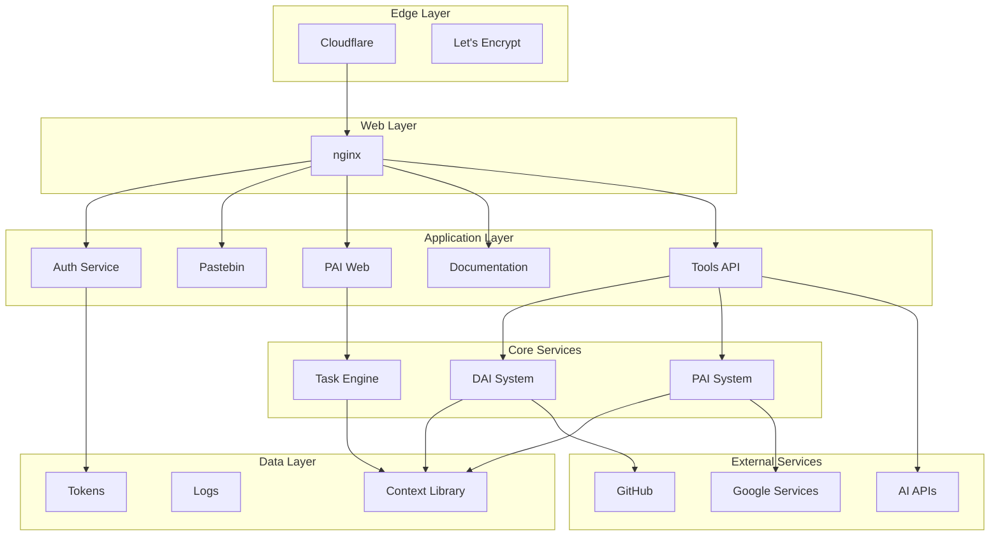

# Architecture Overview

The DAI/PAI ecosystem is built on a modular, microservices architecture designed for reliability, scalability, and AI-native operations.

## System Overview

## Core Principles

### 1. **AI-First Design**
- Every component is designed to be operated by AI agents
- APIs are self-documenting and discoverable
- State is explicitly tracked in the Context Library

### 2. **Modular Architecture**
- Each service is independent and single-purpose
- Services communicate via well-defined APIs
- Failure of one service doesn't cascade

### 3. **Security by Design**
- Multiple authentication layers
- Encrypted secrets management (dotenv-vault)
- Principle of least privilege

### 4. **Observable Systems**
- Comprehensive logging
- Real-time monitoring
- Self-reporting capabilities

## Infrastructure Components

### Web Server (nginx)
- Reverse proxy for all services
- SSL termination
- Basic authentication
- Request routing

### Application Services
- **Authentication** (port 8091): Cookie-based auth
- **Pastebin** (port 8090): File and text sharing
- **PAI Web** (port 8080): Web interface
- **Tools API** (port 8001): Programmatic access
- **Documentation**: This MkDocs site

### Core Systems
- **DAI**: Infrastructure management
- **PAI**: Personal assistant functions
- **Task Engine**: Background job processing

### Data Storage
- **Context Library**: System state tracking
- **Logs**: Centralized logging
- **Tokens**: Authentication credentials

## Design Decisions

### Why Microservices?
- **Isolation**: Services can fail independently
- **Scalability**: Services can scale individually
- **Maintainability**: Easier to understand and modify
- **AI-Friendly**: Clear boundaries for AI operations

### Why nginx?
- **Performance**: Efficient reverse proxy
- **Flexibility**: Easy configuration
- **Security**: Battle-tested security features
- **Compatibility**: Works with all backend services

### Why File-Based Storage?
- **Simplicity**: No database complexity
- **Git-Friendly**: Version control for everything
- **AI-Accessible**: Easy for agents to read/write
- **Portable**: Easy backup and migration

## Security Architecture

### Authentication Layers
1. **Cloudflare**: DDoS protection and CDN
2. **nginx**: Basic HTTP authentication
3. **Application**: Service-specific auth
4. **API**: Token-based authentication

### Secret Management
- Environment variables via `.env` files
- Encrypted storage with dotenv-vault
- No hardcoded credentials
- Regular rotation policies

## Scalability Considerations

### Current Scale
- Single server deployment
- Suitable for personal/small team use
- Sub-second response times
- Minimal resource usage

### Future Scaling
- Horizontal scaling via load balancer
- Service containerization
- Database for high-volume data
- CDN for static assets

## See Also

- [DAI System Architecture](dai-system.md)
- [PAI System Architecture](pai-system.md)
- [PAI Sub-Agent System](pai-subagent-system.md)
- [Infrastructure Details](infrastructure.md)
- [Security Model](security.md)