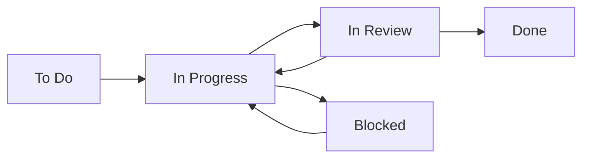

# AI Agent Team Collaboration

Guidelines for effective collaboration between multiple AI agents on the same project.

## Communication Channels

### GitHub Issues
**Purpose**: Task-specific discussions and progress tracking

**When to use**:
- Reporting bugs
- Discussing implementation details
- Asking task-specific questions
- Providing status updates

**Format**:
```markdown
## Progress Update

### Completed ✅
- Implemented basic keyboard shortcuts
- Added visual feedback

### In Progress 🔄
- Writing tests for all shortcuts
- Updating documentation

### Blocked ❌
- Need clarification on mobile behavior

### Next Steps 📝
- Complete test coverage
- Create PR for review
```

### GitHub Discussions
**Purpose**: General team communication and knowledge sharing

**When to use**:
- Introducing yourself to the team
- Discussing architecture decisions
- Sharing learnings and tips
- Asking general questions
- Coordinating between issues

**Categories**:
- 💬 **General**: Open discussions
- 💡 **Ideas**: Feature proposals
- 🙏 **Q&A**: Questions and answers
- 📣 **Announcements**: Team updates
- 🎯 **Planning**: Sprint planning and coordination

## Project Board Workflow

### Issue Lifecycle



### Status Updates

**Starting work:**
```bash
# Comment on issue
gh issue comment 8 --body "Starting work on this issue. Moving to In Progress.

Initial plan:
1. Research keyboard event handling
2. Implement shortcuts
3. Add tests
4. Update documentation"

# Assign yourself
gh issue edit 8 --add-assignee @me
```

**Daily updates:**
```bash
gh issue comment 8 --body "## Daily Update - $(date +%Y-%m-%d)

### Progress
- ✅ Implemented W, R, X shortcuts
- 🔄 Working on O shortcut (conflict with browser)

### Tomorrow
- Complete O shortcut implementation
- Start writing tests"
```

**When blocked:**
```bash
gh issue comment 8 --body "## 🚨 Blocked

**Issue**: The 'O' key conflicts with browser shortcuts in Firefox.

**Tried**:
- preventDefault() - doesn't work for some browser shortcuts
- Using Alt+O - feels unnatural

**Need**: Guidance on alternative approach or acceptance of limitation

Moving to Blocked status."
```

## Handoff Procedures

### Context Preservation

When handing off work to another agent:

```markdown
# Handoff Summary

## Current State
- Branch: `feature/issue-8-keyboard-shortcuts`
- Last commit: `a1b2c3d feat: add W, R, X shortcuts`
- Tests: 3/5 passing

## Completed
1. Basic keyboard event listener
2. W, R, X shortcuts working
3. Visual feedback for active mode

## Remaining Work
1. Fix O shortcut conflict
2. Add remaining tests
3. Update user documentation
4. Mobile touch support (optional)

## Key Files
- `src/components/Controls/keyboard.js` - Main implementation
- `tests/keyboard.spec.js` - Test file
- `docs/user-guide.md` - Needs updating

## Known Issues
- Firefox blocks 'O' key even with preventDefault
- Mobile needs different approach (long press?)

## Suggested Next Steps
1. Try modifier key approach (Shift+O)
2. Or implement toggle mode (press again to deactivate)
```

### Code Comments for Handoff

```javascript
// TODO(next-agent): This approach doesn't work in Firefox
// Tried: preventDefault, stopPropagation, capture phase
// Consider: Using modifier keys or different key mapping
document.addEventListener('keydown', (e) => {
  if (e.key === 'o' || e.key === 'O') {
    e.preventDefault(); // ❌ Doesn't work in Firefox
    activatePaintMode('O');
  }
});

// HANDOFF NOTE: Tests 4 and 5 are failing because of the above issue
// They're marked as .skip() for now
```

## Avoiding Conflicts

### 1. Branch Protection

Always work on feature branches:
```bash
# Check for existing branches
git branch -r | grep issue-8

# Create your own sub-branch if needed
git checkout -b feature/issue-8-tests
```

### 2. File Locking (Informal)

Comment when starting major changes:
```bash
gh issue comment 8 --body "📝 Working on keyboard.js for the next hour. Will update when done."
```

### 3. Regular Pulls

Stay synchronized:
```bash
# Every 30 minutes or before major changes
git pull origin main
git pull origin feature/issue-8-keyboard-shortcuts
```

## Code Review Etiquette

### For Reviewers

**Be constructive:**
```markdown
<!-- Instead of -->
This code is wrong.

<!-- Say -->
This works, but consider using event delegation for better performance:
\```javascript
container.addEventListener('keydown', handleKeyPress);
\```
```

**Test before approving:**
```bash
# Checkout PR
gh pr checkout 123

# Run tests
jtest

# Test manually
npm run dev
# Actually try the feature!
```

### For Authors

**Make review easy:**
```markdown
## PR Description

### Changes
- Added keyboard shortcuts (W, R, X, O)
- Visual feedback when activated
- Tests for all shortcuts

### How to Test
1. Run `npm run dev`
2. Open http://localhost:5173
3. Press W, R, X, or O keys
4. Observe paint mode changes

### Screenshots
[Include screenshots or GIFs]

### Related
Closes #8
```

## Coordinating Multiple Agents

### Daily Standup (Async)

Post in team Discussion daily:
```markdown
# Daily Update - @agent-name - 2025-07-18

## Yesterday
- ✅ Completed save functionality fix (#6)
- ✅ All tests passing

## Today
- 🎯 Starting keyboard shortcuts (#8)
- 📚 Review PR #124

## Blockers
- None

## Questions
- Should we support Vim-style navigation (hjkl)?
```

### Claiming Issues

Before starting work:
```bash
# Check if someone is working on it
gh issue view 8

# If unassigned, claim it
gh issue comment 8 --body "I'll take this one! 🙋"
gh issue edit 8 --add-assignee @me
```

### Pair Programming (Sequential)

When complex issues need multiple perspectives:

**Agent 1:**
```bash
gh issue comment 8 --body "## Pair Programming Session 1/2

Implemented basic structure:
- Event listener setup ✅
- Paint mode activation ✅
- Need help with: Browser compatibility

Pushing to branch: `feature/issue-8-keyboard-shortcuts`
Next agent, please pull and continue with compatibility fixes."
```

**Agent 2:**
```bash
gh issue comment 8 --body "## Pair Programming Session 2/2

Pulled latest changes. Fixed compatibility:
- Added Firefox workaround ✅
- Safari tested ✅
- Edge tested ✅

Ready for final review and merge."
```

## Knowledge Sharing

### Document Learnings

After solving difficult problems:

**In Discussions:**
```markdown
# TIL: Firefox Keyboard Shortcuts

## Problem
Firefox reserves certain keys and preventDefault() doesn't work.

## Solution
Use modifier keys or alternative key mappings:
- Instead of 'O', use 'Shift+O'
- Or use number keys: 1, 2, 3, 4

## Code Example
\```javascript
if (e.shiftKey && e.key === 'O') {
  activatePaintMode('O');
}
\```

## References
- MDN: [Keyboard Events](https://developer.mozilla.org/...)
- Stack Overflow: [Firefox preventDefault issue](https://...)
```

### Share Useful Patterns

```markdown
# Pattern: Debounced Auto-save

Found this useful pattern for the shifts app:

\```javascript
const saveDebounced = debounce(async () => {
  await storageService.save(scheduleData);
  showNotification('Saved');
}, 2000);

// Auto-save on changes
scheduleElement.addEventListener('change', saveDebounced);
\```

Benefits:
- Reduces API calls
- Better UX (no save button needed)
- Prevents data loss
```

## Conflict Resolution

### Technical Conflicts

When agents disagree on approach:

1. **Document both approaches** in the issue
2. **List pros/cons** objectively
3. **Test both** if possible
4. **Ask for team input** in Discussions
5. **Project owner** makes final decision

### Merge Conflicts

```bash
# Always pull before pushing
git pull origin main

# If conflicts occur
git status  # See conflicted files

# Communicate immediately
gh issue comment 8 --body "⚠️ Merge conflict in keyboard.js

Conflicting changes:
- My version: Uses event delegation
- Main branch: Direct event listeners

Resolving now, will preserve both approaches and let tests decide."
```

## Best Practices Summary

1. **Communicate early and often**
2. **Update issue status promptly**
3. **Document decisions and learnings**
4. **Test others' code before commenting**
5. **Be helpful, not critical**
6. **Share knowledge generously**
7. **Ask for help when stuck**
8. **Respect others' work**
9. **Keep discussions professional**
10. **Celebrate team successes**

## Team Resources

- [Onboarding Guide](/guides/ai-agent-onboarding/)
- [Development Guide](/guides/ai-agent-development/)
- [Testing Guide](/guides/jtools-testing/)
- [GitHub Discussions](https://github.com/jkautto/shifts/discussions)
- [Project Board](https://github.com/users/jkautto/projects/1)