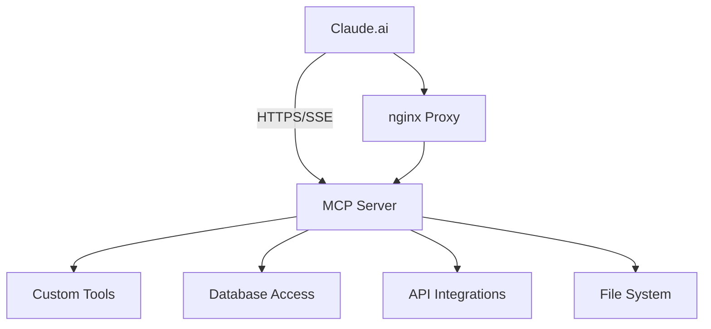

# MCP Architecture Guide

Deep dive into Model Context Protocol architecture, transport mechanisms, and implementation patterns.

## Overview

Model Context Protocol (MCP) is a client-server protocol that enables Large Language Models like Claude to securely access external resources and tools.



## Protocol Foundation

### JSON-RPC 2.0 Base

MCP is built on JSON-RPC 2.0, providing:
- **Standardized messaging**: Request/response patterns
- **Error handling**: Structured error responses
- **Extensibility**: Custom method support
- **Bidirectional communication**: Both client and server can initiate requests

#### Message Structure
```json
{
  "jsonrpc": "2.0",
  "method": "tools/call",
  "params": {
    "name": "hello",
    "arguments": {"name": "World"}
  },
  "id": 1
}
```

#### Response Structure
```json
{
  "jsonrpc": "2.0",
  "result": {
    "content": [{"type": "text", "text": "Hello, World!"}]
  },
  "id": 1
}
```

## Transport Mechanisms

### 1. Streamable HTTP (Production)
- **Transport**: HTTP/HTTPS with Server-Sent Events
- **Connection**: Long-lived persistent connections
- **Authentication**: HTTP-based (OAuth, API keys)
- **Firewall**: Standard HTTPS ports (443)

### 2. WebSocket
- **Transport**: WebSocket over HTTP/HTTPS
- **Connection**: Full duplex, low latency
- **Authentication**: Token-based or session-based
- **Use cases**: Real-time updates, interactive applications

### 3. Standard I/O
- **Transport**: Standard input/output
- **Connection**: Process lifetime
- **Authentication**: Process isolation
- **Use cases**: Development, desktop apps, CLI tools

## Core Protocol Methods

### Tools
- `tools/list`: Get available tools
- `tools/call`: Execute a tool

### Resources
- `resources/list`: Get available resources
- `resources/read`: Read resource content
- `resources/subscribe`: Subscribe to resource changes

### Prompts
- `prompts/list`: Get available prompts
- `prompts/get`: Retrieve a prompt

## Security Architecture

### Authentication Patterns

#### No Authentication (Development)
```python
session_manager = StreamableHTTPSessionManager(
    app=mcp_server,
    authentication=None
)
```

#### API Key Authentication
```python
async def authenticate_api_key(request):
    api_key = request.headers.get("X-API-Key")
    if not validate_api_key(api_key):
        raise AuthenticationError("Invalid API key")
    return {"user_id": get_user_from_key(api_key)}
```

#### OAuth 2.0 Integration
```python
from authlib.integrations.starlette_client import OAuth

oauth = OAuth()
oauth.register(
    name='claude',
    client_id='your-client-id',
    client_secret='your-client-secret'
)
```

## Performance Considerations

### Connection Management
```python
session_manager = StreamableHTTPSessionManager(
    app=app,
    max_connections=100,
    session_timeout=3600
)
```

### Caching
```python
import redis.asyncio as redis

cache = redis.Redis.from_url("redis://localhost")

async def cached_tool_result(key, ttl=300):
    cached = await cache.get(key)
    if cached:
        return json.loads(cached)
    # ... compute result ...
    await cache.setex(key, ttl, json.dumps(result))
    return result
```

### Error Handling
```python
class MCPError(Exception):
    def __init__(self, code: int, message: str):
        self.code = code
        self.message = message

async def handle_tool_error(e: Exception):
    if isinstance(e, ValueError):
        return MCPError(-32602, f"Invalid parameters: {str(e)}")
    else:
        return MCPError(-32603, f"Internal error: {str(e)}")
```

## Deployment Patterns

### Single Server
- Simple setup and maintenance
- Lower resource requirements
- Single point of failure

### Load Balanced
- High availability
- Horizontal scaling
- Shared state management required

### Microservices
- Service isolation
- Independent scaling
- Complex orchestration

For implementation examples, see the [Examples](examples.md) section.