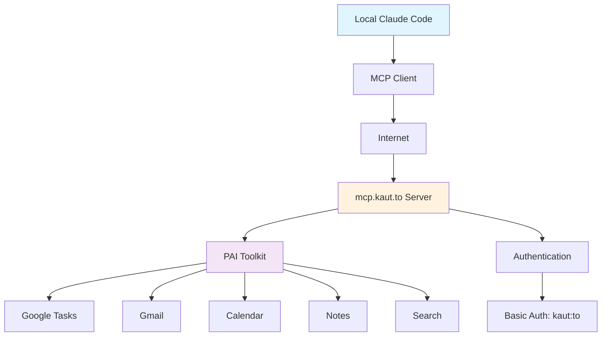

# MCP (Model Context Protocol) Integration

The MCP integration enables local Claude Code instances to connect directly to the PAI system, providing seamless access to personal tools and data without manual API configuration.

## What is MCP?

Model Context Protocol (MCP) is an open standard that allows Claude Code and other AI applications to connect to external services and tools. In the kaut.to ecosystem, MCP serves as a bridge between local Claude Code instances and the centralized PAI infrastructure.

## Architecture Overview



## Current Capabilities

### Task Management
- **Create tasks**: Add new tasks to Google Tasks
- **List tasks**: View today's tasks across all accounts
- **Plan generation**: Create 1-2-3 priority daily plans
- **Task completion**: Mark tasks as completed
- **Multi-account support**: Route tasks to appropriate Google accounts

### Note Management
- **Create notes**: Store notes locally on the PAI server
- **List notes**: Browse all saved notes
- **Read notes**: Access note content and metadata
- **Tag support**: Organize notes with custom tags

### Documentation Management
- **Read documentation**: Access any docs.kaut.to page content
- **Write documentation**: Create and update documentation files
- **Search documentation**: Find content across all docs
- **Structure management**: Get site structure and create sections
- **Auto-building**: Automatic documentation site builds

### Upcoming Features
- **Email integration**: Full Gmail operations
- **Calendar management**: Event creation and scheduling
- **Search integration**: Perplexity-powered research
- **File operations**: PAI system file management

## Benefits of MCP Integration

### For Users
- **Unified interface**: Access PAI tools directly from Claude Code
- **No API setup**: Zero configuration required
- **Real-time access**: Always up-to-date with PAI capabilities
- **Privacy maintained**: All data stays within your ecosystem

### For AI Agents
- **Native tool access**: Use PAI tools as first-class functions
- **Consistent authentication**: Single credential for all services
- **Error handling**: Proper error messages and status codes
- **Structured responses**: JSON-formatted tool outputs

## Quick Start

### Prerequisites
- Claude Desktop app installed
- Access to mcp.kaut.to (Basic Auth: kaut:to)
- Local MacBook setup (for Voice Mode)

### Basic Setup
1. [Configure MCP server](server-setup.md) connection
2. [Set up local Claude Code](local-claude-setup.md) configuration
3. Test connection with health check
4. Start using PAI tools directly in conversations

### Example Usage

```
User: Create a task to "Review Q1 budget proposal" for my xwander account

Claude: I'll create that task for you using the PAI system.
[Uses MCP task tool to create the task]

Task created successfully: "Review Q1 budget proposal" added to your xwander account.

---

User: What documentation exists about MCP tools?

Claude: Let me search the documentation for you.
[Uses MCP docs tool to search]

Found comprehensive MCP documentation including setup guides, tool references, 
and integration examples. Here are the key files...

---

User: Update the API documentation to include the new webhook endpoint

Claude: I'll update the API documentation with the webhook endpoint details.
[Uses MCP docs tool to read current API docs]
[Uses MCP docs tool to write updated documentation]

Documentation updated successfully. The new webhook endpoint is now documented 
at https://docs.kaut.to/api/webhooks/
```

## Server Information

- **URL**: https://mcp.kaut.to (Currently HTTP only - SSL pending)
- **Authentication**: HTTP Basic Auth (username: kaut, password: to)
- **Port**: 3000
- **Status**: Active and operational
- **Health Check**: GET https://mcp.kaut.to/health

## Documentation Structure

- **[Server Setup](server-setup.md)**: Technical details of the MCP server implementation
- **[Local Claude Setup](local-claude-setup.md)**: Configure Claude Desktop for MCP
- **[Voice Mode Setup](voice-mode.md)**: Enable voice interaction with MCP tools
- **[Tools Reference](tools-reference.md)**: Complete documentation of available tools

## Security & Privacy

- **Authentication**: HTTP Basic Auth protects all endpoints
- **Data isolation**: Each request is processed independently
- **Audit logging**: All tool usage is logged for security
- **Rate limiting**: 60 requests per minute to prevent abuse
- **CORS enabled**: Allows browser-based MCP clients

## Support & Troubleshooting

If you encounter issues:

1. Check server health: `curl http://mcp.kaut.to:3000/health`
2. Verify authentication: Ensure you're using `kaut:to` credentials
3. Review logs: Server logs are available at `/srv/pai/logs/mcp_server.log`
4. Test locally: Verify PAI tools work directly on the server

## Development Status

- **Version**: 1.0.0
- **Status**: Production ready
- **Last updated**: January 2025
- **Maintained by**: DAI system

!!! tip "Getting Started"
    New to MCP? Start with the [Local Claude Setup](local-claude-setup.md) guide to get your first connection working in 5 minutes.

!!! warning "SSL Certificate"
    The SSL certificate for mcp.kaut.to is pending. Currently using HTTP on port 3000. HTTPS support will be added soon.